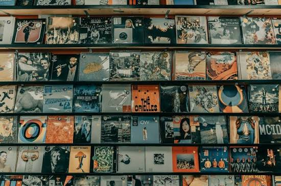

# Web_Ex-1-
<!DOCTYPE html>
<html>
<head>
<meta charset="UTF-8">
<meta name="viewport" content="width=device-width, initial-scale=1.0">
<title>Melody Beats Music Band</title>
</head>

<body style="background-color:lightyellow; color:black; font-family:Arial;" id="top">

<!-- Header Section -->

<h1 style="color:darkblue;">Melody Beats Music Band</h1>

Feel the Rhythm... Enjoy the Music!

<!-- Navigation Section -->

<b><a href="#about">About</a></b> |
<b><a href="#albums">Albums</a></b> |
<b><a href="#gallery">Gallery</a></b> |
<b><a href="#contact">Contact</a></b>

 

<!-- Banner Section -->

<!-- About Section -->

<h2 style="color:darkred;">About Us</h2>

Melody Beats Music Band performs live concerts,
music festivals and cultural events.

<a href="https://www.youtube.com" target="_blank">
Visit Our YouTube Channel
</a>

<!-- Albums Section -->

<h2 style="color:darkred;">Music Albums</h2>

<table border="1" cellpadding="8">

<tr>
<th>Album</th>
<th>Year</th>
<th>Genre</th>
</tr>

<tr>
<td>Melody</td>
<td>2023</td>
<td>Pop</td>
</tr>

<tr>
<td>Rock Beats</td>
<td>2024</td>
<td>Rock</td>
</tr>

<tr>
<td>Golden Tunes</td>
<td>2025</td>
<td>Classical</td>
</tr>

</table>

<!-- Description List Section -->

<h2 style="color:darkred;">Instruments Used</h2>

<dl>

<dt><b>Guitar</b></dt>
<dd>Used to play melodies and music.</dd>

<dt><b>Drums</b></dt>
<dd>Used to create rhythm and beats.</dd>

<dt><b>Microphone</b></dt>
<dd>Used by singers during performances.</dd>

</dl>

<!-- Ordered List Section -->

<h2 style="color:darkred;">Upcoming Shows</h2>

<ol>

<li>South India Tour
<ol>
<li>Chennai</li>
<li>Madurai</li>
</ol>
</li>

<li>College Events
<ol>
<li>Music Fest</li>
<li>Cultural Night</li>
</ol>
</li>

</ol>

<!-- Unordered List Section -->

<h2 style="color:darkred;">Music Genres</h2>

<ul>

<li>Popular Music
<ul>
<li>Pop</li>
<li>Rock</li>
<li>Classical</li>
</ul>
</li>

</ul>

<!-- Gallery Section -->

<h2 style="color:darkred;">Gallery</h2>

Click the first image to visit our YouTube channel.

  

<!-- Hyperlinks Section -->

<h2 style="color:darkred;">Contact Us</h2>

<b>Email:</b>
<a href="mailto:melodybeats@gmail.com">
melodybeats@gmail.com
</a>

<b>Phone:</b>
<a href="tel:+919876543210">
+91 98765 43210
</a>

<b>Website:</b>
<a href="https://www.youtube.com" target="_blank">
Visit Our YouTube Channel
</a>

<a href="#about">Go to About Section</a>

<a href="#top">Back to Top</a>

<!-- Footer Section -->

<h3 style="color:darkblue;">Melody Beats Music Band</h3>

Enjoy Music... Feel the Rhythm!

&copy; 2026 Melody Beats Music Band

</body>
</html>
